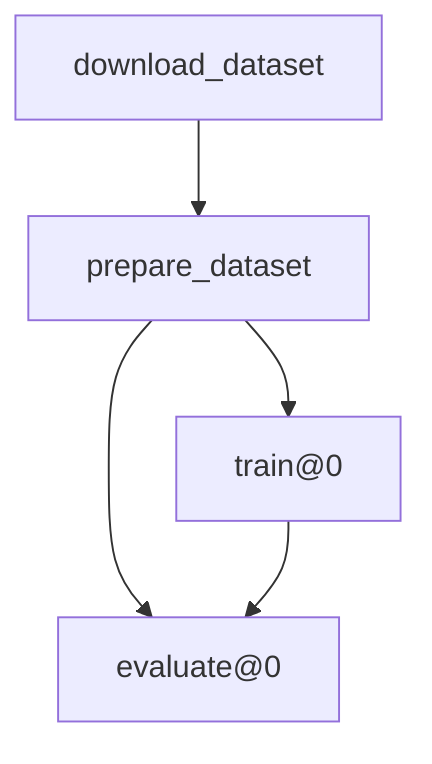
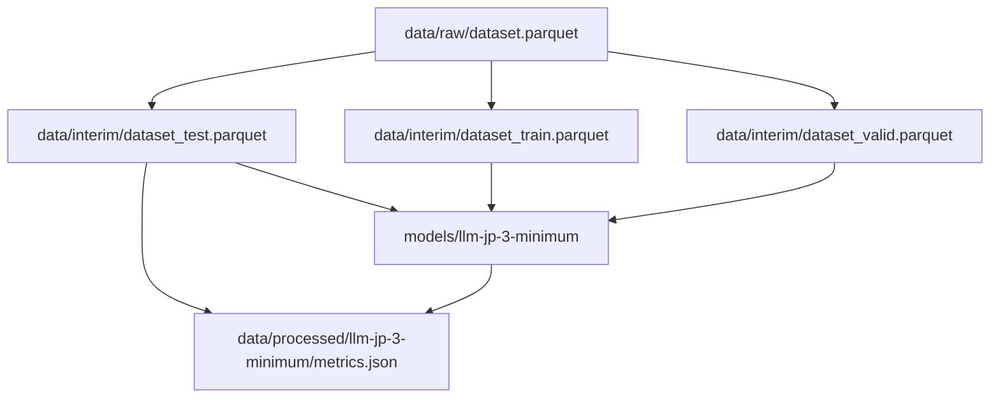

# DVC pipeline

## summary

```mermaid
flowchart TD
	node1["download_dataset"]
	node2["evaluate@0"]
	node3["prepare_dataset"]
	node4["train@0"]
	node1-->node3
	node3-->node2
	node3-->node4
	node4-->node2
```

## detail

```mermaid
flowchart TD
	node1["data/interim/dataset_test.parquet"]
	node2["data/interim/dataset_train.parquet"]
	node3["data/interim/dataset_valid.parquet"]
	node4["data/processed/llm-jp-3-minimum/metrics.json"]
	node5["data/raw/dataset.parquet"]
	node6["models/llm-jp-3-minimum"]
	node1-->node4
	node1-->node6
	node2-->node6
	node3-->node6
	node5-->node1
	node5-->node2
	node5-->node3
	node6-->node4
```
